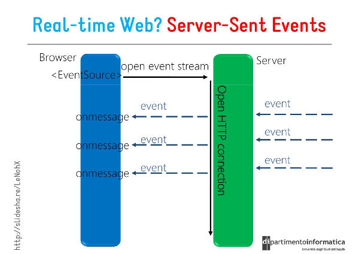

# sse-test

Server-Sent Events 学习与使用


在Spring Boot项目中，无需额外引入特定的依赖，因为Spring Web MVC模块已经内置了对SSE的支持。


# SSE知识点
[Server-Sent Events 教程](https://www.ruanyifeng.com/blog/2017/05/server-sent_events.html)
[](https://www.cnblogs.com/jesn/p/16267606.html)
[Spring Boot中使用Server-Sent Events (SSE) 实现实时数据推送教程](https://blog.csdn.net/u011291844/article/details/136387503)


## 一、SSE 的本质
严格地说，HTTP 协议无法做到服务器主动推送信息。但是，有一种变通方法，就是服务器向客户端声明，接下来要发送的是流信息（streaming）。

也就是说，发送的不是一次性的数据包，而是一个数据流，会连续不断地发送过来。这时，客户端不会关闭连接，会一直等着服务器发过来的新的数据流，视频播放就是这样的例子。本质上，这种通信就是以流信息的方式，完成一次用时很长的下载。

SSE 就是利用这种机制，使用流信息向浏览器推送信息。它基于 HTTP 协议，目前除了 IE/Edge，其他浏览器都支持。

## 二、SSE 的特点
SSE 与 WebSocket 作用相似，都是建立浏览器与服务器之间的通信渠道，然后服务器向浏览器推送信息。

总体来说，WebSocket 更强大和灵活。因为它是全双工通道，可以双向通信；SSE 是单向通道，只能服务器向浏览器发送，因为流信息本质上就是下载。如果浏览器向服务器发送信息，就变成了另一次 HTTP 请求。



但是，SSE 也有自己的优点。
 - SSE 使用 HTTP 协议，现有的服务器软件都支持。WebSocket 是一个独立协议。
 - SSE 属于轻量级，使用简单；WebSocket 协议相对复杂。
 - SSE 默认支持断线重连，WebSocket 需要自己实现。
 - SSE 一般只用来传送文本，二进制数据需要编码后传送，WebSocket 默认支持传送二进制数据。
 - SSE 支持自定义发送的消息类型。

## 协议、格式、事件
### 协议
SSE 协议非常简单，正常的Http请求，更改请起头相关配置即可
```txt
Content-Type: text/event-stream,utf-8
Cache-Control: no-cache
Connection: keep-alive
```
### 基础格式

1、文本流基础格式如下，以行为单位的，以冒号分割 Field 和 Value，每行结尾为 \n，每行会Trim掉前后空字符，因此 \r\n 也可以。
每一次发送的信息，由若干个message组成，每个message之间用\n\n分隔。每个message内部由若干行组成，每一行都是如下格式。
```txt
field: value\n
field: value\r\n
```

Field是有5个固定的name
```txt
data     // 数据内容
event    // 事件
id       // 数据标识符用id字段表示，相当于每一条数据的编号
retry    // 重试,服务器可以用retry字段，指定浏览器重新发起连接的时间间隔
:        //冒号开头是比较特殊的，表示注释
```
2、注释
注释行以冒号开头

```txt
: 当前行是注释
```

### 事件
1、事件
事件之间用 \n\n 隔断，一般一个事件一行，也可以多行
```txt
# 一个事件一行
data: message\n\n
data: message2\n\n


# 一个事件多行
data: {\n
data: "name": "zhangsan",\n
data: "age", 25\n
data: }\n\n

# 自定义事件
event: foo\n   // 自定义事件，名称 foo，触发客户端的foo监听事件
data: a foo event\n\n // 内容

data: an unnamed event\n\n // 默认事件，未指定事件名称，触发客户端 onmessage 事件

event: bar\n   // 自定义时间，名称 bar，触发客户端bar监听事件
data: a bar event\n\n // 内容
```

2、事件唯一标识符
每个事件可以指定一个ID,浏览器会跟踪事件ID，如果发生了重连，浏览器会把最近接收到的时间ID放到 HTTP Header Last-Event-ID 中，作为一种简单的同步机制。

```txt
id: eef0128b-48b9-44f7-bbc6-9cc90d32ac4f\n
data: message\n\n
```

3、重连事件
中断连接，客户端一般会3秒重连，但是服务端也可以配置

```txt
retry: 10000\n
```


